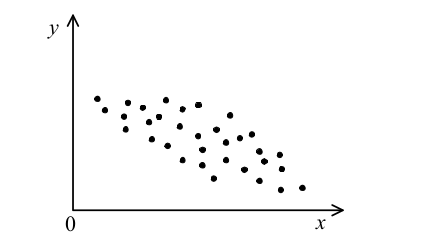

# 1 OR GATE 
### Q1. P, Q, and R are propositions. It is known that the truth value of proposition P is true, and
the values of both the propositions “(not P) or Q” and “(not Q) or R” are true. Which of the
following is a combination of the truth values of Q and R? Here, X or Y represents the
logical sum of X and Y, and not X represents the negation of X.
Q R
a) False False
b) False True
c) True False
d) True True

Let’s solve step by step 👇

🔹 Given:
P = True
🔹 Statement 1:

(not P) or Q = True

not P = False (since P is True)
👉 So: False OR Q = True
👉 This is only possible if Q = True
🔹 Statement 2:

(not Q) or R = True

Q = True → not Q = False
👉 So: False OR R = True
👉 This is only possible if R = True
A / B / C / D format:
A ❌ (False, False) → Q wrong
B ❌ (False, True) → Q wrong
C ❌ (True, False) → R wrong
D ✔ (True, True) → Correct
🔹 Final Answer: D

# 2 CPU Avg Access Time
### Q9. When the CPU needs data, it first accesses the cache memory. When the data is not
available in the cache memory, the CPU accesses the main memory. If the miss ratio is 0.2
and the access times for cache memory and main memory are as shown below, what is the
approximate average memory access time in ns for the CPU? Here, there are only cache
memory and main memory for the CPU, the access time for main memory includes the time
to confirm whether the data is available in cache memory, and the overhead time for the
cache management can be ignored.
Access destination Access time (ns)
Cache Memory 75
Main Memory 1500
a) 315 b) 360 c) 1,215 d) 1,260

🔹 1. Hit Ratio & Miss Ratio
Hit Ratio → Data found in cache (fast)
Miss Ratio → Data NOT found in cache (slow)

👉 Relation:

Hit Ratio + Miss Ratio = 1

🔹 Super short memory:
Hit × cache time → fast part
Miss × memory time → slow part
Add them → average time

# 3
### Q16. A graphical symbol for the 2-to-1 MUX (multiplexer) and its truth table are shown in
the figure below. The MUX has two data inputs (I0, I1), one select-line (S) and one output
(Z). If the select line is S=0, then the output Z is switched to input I0, whereas if a select line
is S=1, then the output Z is switched to input I1.
Which of the following is a logic gate that is equivalent to the circuit implemented with the
2-to-1 MUX below? 
(Q16.png)

2-to-1 MUX behaves like XOR gate

Given:

When X₁ = 0, output Y = X₂
When X₁ = 1, output Y = X₂̅ (NOT X₂)
Compare with XOR behavior

A XOR gate works like this:

If X₁ = 0 → output = X₂
If X₁ = 1 → output = NOT X₂
Conclusion

Since the MUX output matches exactly with XOR behavior:

Y = X₁ ⊕ X₂

Final Answer:

d) XOR gate

same = 0 , not same = 1

| Gate | “Opposite” / Related form |
| ---- | ------------------------- |
| OR   | NOR (inverted OR)         |
| AND  | NAND (inverted AND)       |
| XOR  | XNOR (true complement)    |

# 4 OSI model layers
OSI Model Layers (1 to 7)
Physical Layer → cables, signals, repeaters
Data Link Layer → MAC addresses, switches, bridges
Network Layer → IP addresses, routers
Transport Layer → TCP/UDP, end-to-end delivery
Session Layer → manages sessions/connections
Presentation Layer → data format, encryption, compression
Application Layer → user services (HTTP, FTP, email, etc.)

### Q23. Which of the following is an appropriate description of a device that connects LANs?
a) A bridge relays frames based on IP addresses.
b) A gateway converts the protocols of only the first through third levels in the OSI basic
reference model.
c) A repeater extends the transmission distance by amplifying signals between segments of
the same type.
d) A router relays frames based on MAC addresses. 

# 5 broadcast address
Q24. What is the broadcast address of the network 192.168.128.0/22?
a) 192.168.128.127 b) 192.168.128.255
c) 192.168.131.255 d) 192.168.255.255 

📌 Given:

Network: 192.168.128.0/22

🧠 Step 1: Understand /22 subnet
/22 means subnet mask = 255.255.252.0
Block size in 3rd octet = 256 − 252 = 4

So networks increase like:

192.168.128.0
192.168.132.0
192.168.136.0 …
📌 Step 2: Find the range of this subnet

Start network:

192.168.128.0

Next network:

192.168.132.0

So this subnet covers:

From 192.168.128.0
To 192.168.131.255
📡 Step 3: Broadcast address

Broadcast = last address of the range

👉 192.168.131.255

✔️ Final Answer:

c) 192.168.131.255

# 6 protocol 

Q25. Which of the following is a protocol to gather information on network components to
manage and troubleshoot the network?
a) NTP
b) SMTP
c) SNMP
d) TELNET

## The correct answer is:

c) SNMP

Short notes for each option:

a) NTP (Network Time Protocol)
Used to synchronize time across devices on a network. It doesn’t gather device information.

b) SMTP (Simple Mail Transfer Protocol)
Used for sending emails between servers. Not related to network monitoring.

c) SNMP (Simple Network Management Protocol) ✅
Used to collect and manage information from network devices (like routers, switches, servers). Helps in monitoring, troubleshooting, and managing networks.

d) TELNET
Used for remote login to another device over a network. Not mainly for gathering network status or monitoring.

# 7 Device Connection
 Q26. Which of the following is the way of using a phone to supply an Internet connection to
other devices, such as a tablet or laptop computer over either Wi-Fi or Bluetooth?
a) Dedicated mobile hotspots
c) Tethering
b) PPPoE
d) UPnP

## a) Dedicated mobile hotspots – A separate device (not your phone) that provides internet to other devices using mobile data.

b) PPPoE (Point-to-Point Protocol over Ethernet) – A network protocol mainly used for DSL internet connections, not for sharing phone internet.

c) Tethering – Using your phone to share its internet with other devices via Wi-Fi, Bluetooth, or USB. ✅

d) UPnP (Universal Plug and Play) – A networking feature that helps devices connect automatically on a network, not for sharing internet.

# 8 Work Break Down Structure
Q41. Which of the following is an appropriate purpose for using a Work Breakdown
Structure (WBS) in a software development project?
a) To clarify the sequence relation of activities and understand the critical path that should
be intensively managed
b) To hierarchically detail activities and segment them into a manageable scale
c) To optimize the total cost when there is a trade-off between the duration and the cost of
development
d) To represent the schedule of an activity with a horizontal bar, and clarify the start time
and end time of the activity as well as the progress at the present point in time

## Short explanations:

a) Describes a network diagram / critical path method (CPM) – focuses on activity sequence and critical path.

b) Describes WBS – breaks the project into smaller, manageable parts. ✅

c) Describes cost-time trade-off (crashing) – used to optimize cost vs. duration.

d) Describes a Gantt chart – shows schedule with bars, start/end times, and progress.
----------------------------------------------------------------------
b) To hierarchically detail activities and segment them into a manageable scale

# 9 Scope Creep

Q42. Which of the following is an appropriate explanation concerning the scope creep in
project scope management?
a) A hierarchical decomposition of the total scope of work to be carried out by the project
team to accomplish the project objectives and create the required deliverables
b) Any change to the project scope, which almost consistently requires an adjustment to the
project cost or schedule
c) The sum of the products, services, and results to be provided as a project
d) The uncontrolled expansion of product or project scope without adjustments to time,
cost, and resources

## Short explanations:

a) Describes WBS – breaking work into smaller parts.

b) Describes scope change – controlled changes needing cost/schedule updates.

c) Describes project scope – total deliverables of a project.

d) Describes scope creep – uncontrolled expansion without proper adjustments. ✅

d) The uncontrolled expansion of product or project scope without adjustments to time, cost, and resources

# 10 Service Level Management
Q43.
Which of the following is a requirement for service level management?
a) A capacity plan is created, implemented, and maintained while human, technical,
informational, and financial resources are considered.
b) A service catalog and SLA are created for the service to be provided, and they are
agreed upon with the customer.
c) Costs are monitored and reported against the budget; the financial forecasts are
reviewed, and costs are managed.
d) Risks to service continuity and availability of services are assessed and documented.

## Short explanations:

a) Describes capacity management – planning resources.

b) Describes service level management – defining and agreeing on SLAs with customers. ✅

c) Describes financial management – handling costs and budgets.

d) Describes IT service continuity management – managing risks to service availability.

The correct answer is:

b) A service catalog and SLA are created for the service to be provided, and they are agreed upon with the customer.

# 11 Average Number of failer time
Q44. A device that operates 24 hours a day, 360 days a year has an MTBF value of 1,440
hours. Which of the following is the average number of failures for this device for 360 days?
Here, the result is rounded to the closest whole number, and the MTTR of the device is
ignored.
a) 3
b) 6
c) 9
d) 12

## explination
a) 3 – Too low; based on calculation, the device fails more often than this.
b) 6 – Correct; total hours (8640) ÷ MTBF (1440) = 6 failures. ✅
c) 9 – Too high; would mean failures happen more frequently than given MTBF.
d) 12 – Much too high; does not match the MTBF calculation.

# 12 system auditor
Q45. 
Which of the following is the most appropriate description of a system auditor?
a) The entire audit interview must be conducted by one (1) system auditor, because
discrepancies may occur in the record if multiple auditors are involved.
b) The system auditor must instruct the department being audited to implement
improvement measures for deficiencies identified during the audit interview.
c) The system auditor must make an effort to obtain documents and records that support the
information obtained from the department being audited during the audit interview.
d) The system auditor must select audit interviewees from administrators who have been an
auditor within the department being audited.

## explination
a) Incorrect – Audits can involve multiple auditors; teamwork is common.

b) Incorrect – Auditors identify issues, but do not directly instruct implementation (they recommend).

c) Correct – Auditors must collect evidence (documents/records) to support findings. ✅

d) Incorrect – Interviewees are chosen based on relevance, not whether they were auditors.

-----------------------------------------------------------------------------------------

c) The system auditor must make an effort to obtain documents and records that support the information obtained from the department being audited during the audit interview.

# 13 
Q56. Which of the following is a technique that can be used to discover useful information and
relationships from large amounts of customer and market data retained by a company?
a) Data dictionary
c) Data mining
b) Data flow diagram
d) Data warehouse

## explination

a) Data dictionary – A document that defines data items, their meanings, formats, and usage in a database system.

b) Data flow diagram – A diagram that shows how data moves through a system and how it is processed.

c) Data mining – The process of analyzing large datasets to find useful patterns, trends, and relationships.

d) Data warehouse – A large storage system that collects and stores data from different sources for analysis and reporting.

# 14
Q57. The relationship between the value “x” of a certain factor in the manufacture of a
product and the value “y” of a quality characteristic of the product is plotted in the figure
below. Which of the following is an appropriate interpretation of this figure?

a) In order to estimate y from x, a quadratic regression coefficient needs to be calculated.
b) The correlation coefficient between x and y is negative.
c) The correlation coefficient between x and y is positive.
d) The regression expression for estimating y from x is the same as that for estimating x from y.

# 15
### Q58

Two (2) types of raw materials **A** and **B** are required to manufacture products **X** and **Y**.  

The quantity of each raw material required per unit and the procurable quantity are listed in the table below.  

When the profit per unit is **$1** for product **X** and **$1.5** for product **Y**, which of the following is the **maximum profit (in dollars)**?

| Raw material | Required quantity per unit of product X | Required quantity per unit of product Y | Procurable quantity |
|--------------|----------------------------------------|----------------------------------------|---------------------|
| A            | 2                                      | 1                                      | 100                 |
| B            | 1                                      | 2                                      | 80                  |

**Options:**

a) 50  
b) 60  
c) 70  
d) 80  

### This is a linear programming problem where you want to maximize profit under resource constraints.

Let:

x = units of product X
y = units of product Y

Profit function (maximize):
Profit = 1x+1.5y

Constraints from raw materials:

Material A: 2x+y≤100
Material B: x+2y≤80
x,y≥0

The maximum profit occurs at a corner point of the feasible region. Solve the intersection:

{
2x+y=100
x+2y=80
	​

Solving:

From equations → x=40,y=20

Profit = 1(40)+1.5(20)=40+30=70

Final Answer: 70 (option c)

# 16 
Q59. When the selling price of a product is $50 and the fixed costs for production and sales
are $100,000, which of the following is the number of units to be sold to achieve the desired
profit of $50,000? Here, the variable cost ratio is 60%.
a) 5,000
Q60.
b) 7,500
c) 10,000
d) 12,500

### This is a cost-volume-profit (CVP) problem.

Given:

Selling price per unit = 50
Variable cost ratio = 60% → Variable cost = 0.6×50=30
Contribution per unit = 50−30=20
Fixed cost = 100,000
Desired profit = 50,000

Formula:

Required units=
Contribution per unit
Fixed Cost+Target Profit
=
20
100,000+50,000
	​

=
20
150,000
	​

=7,500

Final Answer: b) 7,500

# 17 volume license agreement
Q60.
b) 7,500
c) 10,000
d) 12,500
Which of the following is an explanation of a volume license agreement?
a) A contract that establishes standard license conditions and deems that a license
agreement is automatically established between the rightsholder and the purchaser when
a certain amount of package is unwrapped within the scope of the standard license
conditions
b) A contract that predefines the number of installations and permits the use of software for
companies or other such purchasers of large amounts of software
c) A contract that restricts the location of use and permits the use of an unlimited number
of units or persons within a specific facility
d) A contract where use is permitted by selecting to agree to the terms of the contract on
the screen that is displayed when software is downloaded from the Internet

### The question asks for the definition of a volume license agreement.

A volume license is used by organizations (like companies or schools) that need many copies of software. Instead of buying individual licenses, they get a contract that covers multiple installations under one agreement.

Correct answer:

b) A contract that predefines the number of installations and permits the use of software for companies or other such purchasers of large amounts of software

Why others are wrong (quickly):

a) describes a shrink-wrap license
c) describes a site license
d) describes a click-wrap (or click-through) license