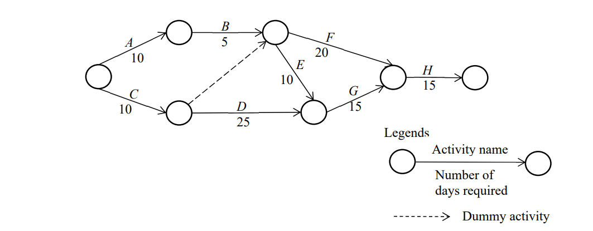

# 1 ( Activities )
## Q 41The activities and milestones of a project are shown in the arrow diagram below. Which
of the following is an appropriate description of the project if the duration of activity B is
increased by 5 days? 

(10)        (5)         (20)
    A --------O--------- B --------O--------- F --------.
   /          ^                   |                      \
  /           : (Dummy)           | (10)                  \      (15)
O             :                   v                        O --------- H -------- O
  \           :                   E                       /
   \   (10)   :      (25)         |     (15)             /
    C --------O--------- D --------O--------- G --------'

a) The earliest start time of activity G is delayed by 5 days.
b) The latest start time of activity F is delayed by 5 days.
c) The project’s minimum completion time does not change.
d) The project’s minimum completion time is increased by 5 days. 

🔹 One-line memory trick:
EST = Earliest possible
LST = Latest without delay

# 2 CPI ( Cost calculation )
## Q42. What is the Cost Performance Index (CPI) of the project under the conditions listed
below?

+-----------------------+-----------------+
| Project Budget (BAC)  | 100,000 dollars |
| Project Duration      | 4 months        |
| Elapsed Time          | 1 month         |
| Actual Cost (AC)      | 20,000 dollars  |
| Project Progress      | As planned      |
+-----------------------+-----------------+

a) 0.25 b) 0.8 c) 1.0 d) 1.25

CPI (Cost Performance Index) = EV / AC

EV (Earned Value) = value of work done
“As planned” → after 1 month out of 4 months = 25% completed

So:

EV = 25% of 100,000 = 25,000
AC = 20,000

👉 CPI = 25,000 / 20,000 = 1.25

A / B / C / D format:

A ❌ 0.25 → Incorrect calculation
B ❌ 0.8 → Would mean over budget
C ❌ 1.0 → Means exactly on budget
D ✔ 1.25 → Correct (project is under budget)
🔹 Quick meaning:
CPI > 1 → Good (under budget)
CPI = 1 → On budget
CPI < 1 → Over budget

Final Answer: D

🔹 Basic Terms
EV (Earned Value) → Value of work actually completed
PV (Planned Value) → Value of work planned to be completed
AC (Actual Cost) → Actual money spent (sometimes written as EC in some notes)

🔹 Variances (difference)
CV (Cost Variance) = EV − AC
→ + = under budget, − = over budget
SV (Schedule Variance) = EV − PV
→ + = ahead of schedule, − = behind schedule

🔹 Indexes (performance ratio)
CPI (Cost Performance Index) = EV / AC
→ >1 good, <1 bad
SPI (Schedule Performance Index) = EV / PV
→ >1 ahead, <1 behind

🔹 Super short memory:
EV = done work value ( earn value )
PV = planned work value ( plan value )
AC = actual cost
Variance = difference
Index = ratio

# 3 Service Life Cycle 1.stretagy -> design -> transition -> operation -> continous improvement 
👉 Plan → Build → Deploy → Run → Improve
ITIL lifecycle order

Q43. In ITIL 2011 edition, which of the following is the appropriate order for the service
lifecycle stages?
a) Service design  Continual service improvement  Service strategy  Service
operation  Service transition
b) Service design  Service strategy  Service operation  Service transition 
Continual service improvement
c) Service strategy  Service design  Service operation  Service transition 
Continual service improvement
d) Service strategy  Service design  Service transition  Service operation 
Continual service improvement 

A / B / C / D format:
A ❌ → Wrong order (CSI placed too early)
B ❌ → Strategy must come before design
C ❌ → Transition and operation are in wrong order
D ✔ → Correct ITIL lifecycle order

# 4 Incident management = handle user issues + match with known errors
## Q44. In IT service management, which of the following is an activity performed for the
management of incidents and service requests?
a) Evaluating if customer satisfaction with the service desk meets the agreed service targets
and performing a review to identify improvement opportunities
b) Examining measures wherein the amount of free space on a disk is near its threshold
c) Investigating the impact of changes made to a program
d) Receiving a failure report from a user and checking to see if it corresponds to a known
error 

Answer: d) Receiving a failure report from a user and checking to see if it corresponds to a known error

A / B / C / D format:
A ❌ → Service level management / CSI activity
B ❌ → Capacity or event management (monitoring resources)
C ❌ → Change management activity
D ✔ → Incident management: logging incidents and checking known errors
🔹 Short idea:

Incident management = handle user issues + match with known errors

Final Answer: D

# 5 System Auditor
Q45. Which of the following is the most appropriate description concerning an interview
conducted by a system auditor?
a) The administrator of the audited department, who has experience in auditing tasks, is
selected as the interviewee.
b) The entire interview is conducted by one (1) system auditor, as discrepancies may occur
in the record if multiple auditors are involved.
c) The system auditor instructs the audited department to take improvement measures for
deficiencies found during the interview.
d) The system auditor makes an effort to obtain documents and records that support the
information obtained from the audited department during the interview. 

Answer: d) The system auditor makes an effort to obtain documents and records that support the information obtained from the audited department during the interview.

A / B / C / D format:
A ❌ → Interviewees should be relevant staff, not necessarily auditors.
B ❌ → Multiple auditors can participate; no such restriction.
C ❌ → Auditors do not give direct instructions; they provide recommendations.
D ✔ → Correct: auditors verify interview information with evidence (documents/records).
🔹 Short idea:

Audit = trust but verify (use evidence)

Final Answer: D

# 6 the maximum value just calculate
Q56. Which of the following is the maximum value of Z from the constraints that are shown
below?
x + y ≤4
x ≥ 0, y ≥ 0
Z= 3x + 4y
a) 12 b) 14 c) 16 d) 18

#  7 
Q57. When a company wants to earn a profit of $42,000, which of following is the number
of units that the company must sell under the conditions shown in the table below?
 Unit: dollar
Selling price per unit 17
Fixed costs
 General and administrative expense 130,000
 Interest expense 10,000
Variable costs
 General and administrative expense 3
 Selling expense 4
a) 14,000 b) 18,200 c) 26,000 d) 26,200

🔹 Step 1: Calculate contribution per unit

Selling price = 17
Variable cost = 3 + 4 = 7

👉 Contribution per unit = 17 − 7 = 10

🔹 Step 2: Total fixed cost

Fixed cost = 130,000 + 10,000 = 140,000

🔹 Step 3: Required profit

Profit = 42,000

👉 Total needed = Fixed cost + Profit
= 140,000 + 42,000 = 182,000

🔹 Step 4: Units required

Units = Total needed ÷ Contribution per unit
= 182,000 ÷ 10 = 18,200 units

A / B / C / D format:
A ❌ 14,000 → Too low
B ✔ 18,200 → Correct
C ❌ 26,000 → Too high
D ❌ 26,200 → Incorrect
🔹 Quick idea:

Units = (Fixed cost + Profit) ÷ Contribution

### fixed cost will never change like constant and variable cost will depend on selling units

# 8 equalitly management
Q58. Which of the following is part of total quality management?
a) Designing products and services that meet or exceed customers’ expectations
b) Focusing on the appointment of staff with long-term work experience in a similar
environment
c) Prioritizing central decisions rather than empowerment to ensure the quality of products
and services
d) Promoting the capability of each department to work independently in a competitive
manner

Answer: a) Designing products and services that meet or exceed customers’ expectations

A / B / C / D format:
A ✔ Correct (TQM principle) → TQM focuses on customer satisfaction by designing quality products/services that meet or exceed expectations.
B ❌ → Hiring experience-based staff is HR policy, not TQM.
C ❌ → TQM promotes employee involvement and empowerment, not central control.
D ❌ → TQM emphasizes cooperation and continuous improvement, not internal competition.
🔹 Simple idea:

TQM = Customer-focused + continuous improvement + employee involvement

Final Answer: A

