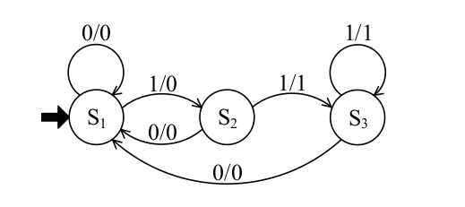
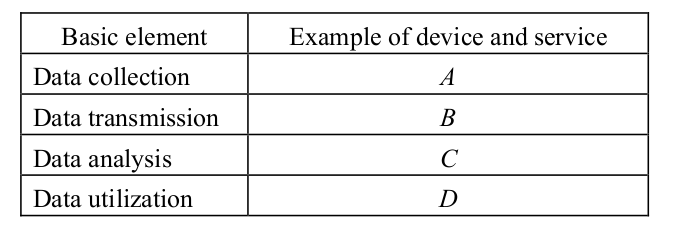

# 1 
Q4.Finite Automaton / State Machine question.
For an automaton with input and output symbols {0, 1} and a state transition diagram shown
below, which of the following is the output string for the input string 0011001110? Here, S1
represents the initial state, and the label x/y on each arc indicates that if x is an input, then y
is the corresponding output at the state transition.

a) 0001000110
c) 0010001000
b) 0001001110
d) 0011111110

### Let’s walk through it step by step from initial state S1.

Given transitions (important ones):
S1
0 → S1 (output 0)
1 → S2 (output 0)
S2
0 → S1 (output 0)
1 → S3 (output 1)
S3
0 → S1 (output 0)
1 → S3 (output 1)
Input string:

0 0 1 1 0 0 1 1 1 0

Step-by-step:
Input	State → Next	Output
0	S1 → S1	0
0	S1 → S1	0
1	S1 → S2	0
1	S2 → S3	1
0	S3 → S1	0
0	S1 → S1	0
1	S1 → S2	0
1	S2 → S3	1
1	S3 → S3	1
0	S3 → S1	0
Output string:

0001000110

✅ Final Answer:

a) 0001000110

# 2 Q7 oob 
In object-oriented programming, which of the following is the concept that refers to a class
that defines a method with the same name and type signature as a method in its superclass?
a) Hiding
c) Overloading
b) Inheritance
d) Overriding

The correct answer is:

d) Overriding

In object-oriented programming, method overriding occurs when a subclass provides a specific implementation of a method that already exists in its superclass, using the same name and the same type signature.

# 3 Operating System
Q13. Five processes A, B, C, D and E arrive at almost the same time in the order of A, B, C, D
and E. The processes have estimated running times of 10, 6, 2, 8, and 4 milliseconds,
respectively. Which of the following is the average process turnaround time with the First-
Come-First-Served (FCFS) scheduling algorithm?
a) 14
b) 19.2
c) 20
d) 22

Let’s solve it step by step using FCFS (First-Come-First-Served).

Given:

Arrival order: A → B → C → D → E
Burst times (ms):

A = 10
B = 6
C = 2
D = 8
E = 4
Step 1: Completion time

We add cumulatively:

A: 10
B: 10 + 6 = 16
C: 16 + 2 = 18
D: 18 + 8 = 26
E: 26 + 4 = 30
Step 2: Turnaround time (since all arrive at same time ≈ 0)
A = 10
B = 16
C = 18
D = 26
E = 30
Step 3: Average turnaround time
Average=
5
10+16+18+26+30
	​

=
5
100
	​

=20
✅ Final Answer:

c) 20

# 4 File Organization (Operating Systems / DBMS),
Q14. In indirect addressing of direct file organization, which of the following is an appropriate
method for calculating the record address from a record key in the superposition addressing
method, or folding and adding method? Here, the record key is 123456 in decimal. The total
number of records is 1,000, and the closest prime number to 1,000 is 997. The decimal number
123456 is equivalent to 361100 in octal.
a) Converting the record key into 361100 and using it as the address
b) Dividing the record key by 997 and using the remainder of 825 as the address
c) Splitting the record key into 123 and 456 and using their sum, 579, as the address
d) Using the record key 123456 as the address

### This question is from File Organization (Operating Systems / DBMS), specifically:

👉 Hashing / Address calculation using folding method & indirect addressing

🔍 Key idea: “Folding and adding method”

In this method:

The record key is split into parts
The parts are added together
The result is used as the address (often with modulo reduction, but not always shown here)
Given:
Key = 123456
Total records ≈ 1000 → nearest prime = 997
Octal conversion (361100) is a distractor
Evaluate options:
a) Use 361100 (octal form)

❌ Incorrect — conversion is irrelevant to folding method

b) Divide by 997 and use remainder 825

❌ This is division hashing method, not folding

c) Split 123456 → 123 and 456

Now apply folding:

123+456=579

✔ This is exactly folding and adding method

d) Use 123456 directly

❌ No hashing or addressing applied

✅ Final Answer:

c) Splitting the record key into 123 and 456 and using their sum, 579, as the address

💡 Quick concept takeaway:
Folding method = split → add → use result
Division method = key mod prime number
Direct use = not a valid hashing technique in this context

# 5 LRU Least Recently Used
Q15. The page capacity of main memory is three pages, and the pages are referenced in the
order {1, 2, 3, 2, 1, 4, 5}. Which of the following is the page that will be replaced from main
memory for the last page reference if LRU is used as the page replacement technique?
a) 1
b) 2
c) 3
d) 4
### We solve this using LRU (Least Recently Used) page replacement with 3 frames.

🔢 Page reference string:

1, 2, 3, 2, 1, 4, 5

Memory capacity = 3 pages

Step-by-step simulation:
1 → [1]
2 → [1, 2]
3 → [1, 2, 3] (memory full)
2 → already in memory → update recent use
1 → already in memory → update recent use

Current order (recent → old):
1 (recent), 2, 3

4 → page fault → replace LRU

Least recently used = 3

Memory → [1, 2, 4]

5 → page fault → replace LRU

Now usage order:

2 was least recently used (since 1 and 4 were used more recently)

So replace 2

Memory → [1, 5, 4]

❓ Question asks:

👉 Which page is replaced for the last reference (5)?

✔ Replaced page = 2

✅ Final Answer:

b) 2

💡 Key idea:

LRU always removes the page that was used farthest in the past, not the one with lowest number or oldest arrival.

# 6 Relational Model (DBMS)
Q18. Which of the following is the appropriate explanation of attributes in the relational
model?
a) It is possible to define attributes that have no name.
b) The domains of definition for attributes within a relation must not overlap.
c) The same name can be given to two (2) or more attributes in a relation.
d) There is no meaning in the order of attributes within a relation, and the relation remains
unchanged even if the order is changed.

### This is from the Relational Model (DBMS) concept of attributes.

Let’s evaluate each option:
a) Attributes with no name

❌ Incorrect
In the relational model, every attribute must have a unique name.

b) Domains must not overlap

❌ Incorrect
Different attributes can have overlapping domains (e.g., Age and Experience both can be integers).

c) Same name for multiple attributes

❌ Incorrect
Each attribute in a relation must have a unique name.

d) Order of attributes has no meaning

✔ Correct
In the relational model:

A relation is a set of attributes
Sets have no order
So changing column order does not change the relation
✅ Final Answer:

d) There is no meaning in the order of attributes within a relation, and the relation remains unchanged even if the order is changed.

💡 Key concept:

Relational model = theory-based model

Order of rows → no meaning
Order of columns → no meaning
Names → must be unique
Domains → can overlap

# 7 Transitive Functional Dependency
Q19. When the functional dependencies shown below are satisfied, which of the following is
the transitive functional dependency that holds? Here, “A→B” indicates that B is functionally
dependent on A, and “A→{B, C}” indicates that “A→B” and “A→C ” both hold.
[Functional dependencies]
{OrderCode, ProductCode} → {CustomerOrderQuantity, OrderAmount}
OrderCode → {OrderDate, CustomerCode, OrderManagerCode}
ProductCode → {ProductName, SupplierCode, ProductSalePrice}
SupplierCode → {SupplierName, SupplierAddress, SupplierManagerCode}
CustomerCode → {CustomerName, CustomerAddress}
a) OrderCode → CustomerCode → CustomerAddress
b) OrderCode → ProductCode → CustomerOrderQuantity
c) ProductCode → SupplierCode → ProductSalePrice
d) SupplierCode → SupplierManagerCode → SupplierAddress

### Key idea: Transitive Functional Dependency

A transitive dependency happens when:

If
A → B and B → C, then
👉 A → C (transitively)

Given functional dependencies:
OrderCode → CustomerCode
CustomerCode → CustomerAddress

Also:

ProductCode → SupplierCode
SupplierCode → SupplierName, SupplierAddress, SupplierManagerCode
Now check options:
a) OrderCode → CustomerCode → CustomerAddress

✔ OrderCode → CustomerCode (given)
✔ CustomerCode → CustomerAddress (given)

So:
👉 OrderCode → CustomerAddress (transitive)

✔ This is a correct transitive dependency

b) OrderCode → ProductCode → CustomerOrderQuantity

❌ No direct dependency:

OrderCode does NOT determine ProductCode

So invalid

c) ProductCode → SupplierCode → ProductSalePrice

❌ SupplierCode does NOT determine ProductSalePrice
(ProductSalePrice is directly from ProductCode)

So invalid chain

d) SupplierCode → SupplierManagerCode → SupplierAddress

❌ SupplierManagerCode does NOT determine SupplierAddress

So invalid

✅ Final Answer:

a) OrderCode → CustomerCode → CustomerAddress

💡 Quick exam tip:

To find transitive dependency:

Look for a chain where middle attribute is both RHS and LHS

Here:

CustomerCode is RHS of one rule
and LHS of another → perfect bridge ✔

# 8 Distribute database
Q20.
Which of the following is an appropriate description of distributed database?
a) Access to a database server is shared among a globally distributed userbase so that
everyone can access the database.
b) It is a database that is distributed to all interested researchers and other users worldwide
so that everyone can benefit.
c) It is a NoSQL database instead of a Relational Database Management System
(RDBMS).
d) It stores different parts of a database in different locations, and its processing is
distributed across those parts.

# 9 DB Query
Q21. Which of the following is the clause that is inserted into blank A of the SQL statement in
order to display the names of employees who work in the same department as any employee
located in "New York"?
Employees (employee_id, employee_name, salary, department_id)
Departments (department_id, department_name, location)
[SQL command]
SELECT employee_name FROM Employees WHERE
A
a) department_id IN (SELECT department_id FROM Departments WHERE location =
'New York');
b) department_id NOT IN (SELECT department_id FROM Departments WHERE location
= 'New York');
c) department_id IN (SELECT department_id FROM Employees WHERE location =
'New York');
d) department_id = ALL (SELECT department_id FROM Employees WHERE location =
'New York');

### Explination 

We need to find:

Employees who work in the same department as employees located in "New York"

Step 1: Understand the tables
Employees

(employee_id, employee_name, salary, department_id)

Departments

(department_id, department_name, location)

👉 Location is in Departments table, not Employees

Step 2: Logic

We first need:

Departments located in New York
Then get their department_id
Then find employees in those departments

So the condition becomes:

👉 employee’s department_id ∈ (departments in New York)

Step 3: Correct SQL clause

department_id∈(SELECT department_id FROM Departments WHERE location = ’New York’)

Step 4: Match options
a)

✔ Correct:

department_id IN (SELECT department_id FROM Departments WHERE location = 'New York');
b)

❌ Wrong meaning (excludes instead of includes)

c)

❌ Wrong table used (Employees has no location)

d)

❌ Incorrect logic using ALL and wrong reference

✅ Final Answer:

a) department_id IN (SELECT department_id FROM Departments WHERE location = 'New York');

💡 Key idea:
Use IN + subquery from correct table
Location comes from Departments, not Employees

# 10 ACID properties in DBMS (Transaction Management)
Q22. In the context of transaction management, which of the following is a condition that the
Isolation property ensures?
a) Data is written permanently after a transaction.
b) Only valid data is written to the database.
c) Transactions are either fully completed or revoked.
d) Transactions are executed without affecting each other.

### Explination
a) Data is written permanently after a transaction

❌ This is Durability, not Isolation

b) Only valid data is written to the database

❌ This is related to Consistency

c) Transactions are either fully completed or revoked

❌ This is Atomicity

d) Transactions are executed without affecting each other

✔ This is exactly Isolation

✅ Final Answer:

d) Transactions are executed without affecting each other.

💡 Quick memory trick (ACID):
Atomicity → All or nothing
Consistency → Valid data only
Isolation → No interference
Durability → Permanent storage

# 11 UML Diagram
Q39 Which of the following is an appropriate description of a UML use case diagram?
a) It shows the behavior during the object’s life cycle using finite state transitions.
b) It shows the exchange of messages among objects and objects’ lifelines in a time series.
c) It shows the flow from one activity to another activity in a system or business process.
d) It shows the scenarios for how actors, i.e., external users or machines, interact with a
system.

### Explination
A UML Use Case Diagram is used to show:

Actors (users or external systems)
Their interactions with the system
Different scenarios (use cases)

👉 It focuses on what the system does from a user’s perspective

❌ Why other options are wrong:
a)

Describes a State Diagram (object life cycle)

b)

Describes a Sequence Diagram (messages over time)

c)

Describes an Activity Diagram (workflow/process flow)

💡 Quick memory trick:
Use Case Diagram → “Who uses the system & what they do”
✅ Final Answer:

# 12 Software Architecture
Q35. In the development process, which of the following is an activity that should be
performed in software architecture design?
a) Analyzing the requirements in incremental steps by arranging them in the form of a chart
b) Describing the specifications so that the program is clarified on a line-by-line basis
c) Obtaining the opinion of the customer and deciding on the specifications
d) Transforming the requirements for the software items into a design that describes its top-
level structure and identifies the software components

### Explination 
Software architecture design is about:

Converting requirements → high-level structure
Defining:
Major components/modules
Their relationships
Overall system structure

👉 It’s a high-level design phase, not detailed coding

❌ Why others are wrong:
a)

❌ This is requirements analysis, not architecture design

b)

❌ This is detailed design / coding level, too low-level

c)

❌ This is requirements gathering with customer

💡 Simple idea:

Architecture design = big picture of the system (modules + structure)

✅ Final Answer:

d)

# 13 state transition test in a system integration test
Q36. Which of the following is an appropriate description concerning a state transition test in
a system integration test?
a) A method for black box tests that does not focus on a system’s internal state.
b) A method that checks whether a system behaves according to the designed combinations
of events and internal states.
c) A method that is suitable for tests of calculations and processing systems whose internal
state does not change depending on the occurrence of an event.
d) A method that uses a data flow diagram and a decision table to analyze the internal state
of a system.

### Explination
a)

❌ Says it does NOT focus on internal state
→ Wrong, state is the main focus

c)

❌ Says internal state does NOT change
→ Opposite of state transition concept

d)

❌ Talks about data flow diagrams & decision tables
→ Different testing techniques

💡 Simple idea:

State transition testing = “If this happens in this state, what should happen next?”

✅ Final Answer:

b)

# 15 acceptance test
Q37.
Which of the following is an appropriate description of an acceptance test?
a) It is conducted by developers to verify response time and other performance items.
b) It is conducted by testers to ensure that the interfaces and linkages between different
software parts work properly.
c) It is conducted by the project manager to verify whether users’ functional requirements
are met or not.
d) It is conducted by users to confirm that the software is complete and meets the business
needs that prompted the software to be developed.

### Explination
a)

❌ Performance testing (response time), not acceptance test

b)

❌ Integration testing (checking interfaces between modules)

c)

❌ Project manager does not perform acceptance testing
→ It is done by users

💡 Simple memory:

Acceptance test = User says “Yes, this is what I need”

✅ Final Answer:

d)

Unit → Integration → System → Operational → Acceptance → Approval
Unit Test → test individual components (by developer)
Integration Test → test interaction between modules
System Test → test complete system
Operational Test → test in real environment (backup, recovery, etc.)
Acceptance Test (UAT) → users check if it meets requirements
Approval Test → final user approval before release

# 16 Software Dev Activities
Q39.Which of the following is refactoring in software development activities?
a) In order to improve the maintainability of a program, its internal structure is modified
without any change to the external specifications.
b) In order to improve the quality of a program, two programmers cooperate to perform the
coding of a single program.
c) In order to obtain feedback from users, the prototype of a program to be provided is
created at an early stage.
d) In order to promptly develop a program to be operated, test cases are set in advance, and
the program is then coded.

### Short explanation:

Refactoring =
👉 Improving internal code structure
👉 Without changing external behavior/output

❌ Other options:
b) Pair programming
c) Prototyping
d) Test-Driven Development (TDD)
💡 One-line memory:

Refactoring = clean the code, don’t change what it does
Correct Answer:

a) In order to improve the maintainability of a program, its internal structure is modified without any change to the external specifications.

# 17 benchmarking
Q49. Which of the following is an explanation of benchmarking that is used for corporate
management?
a) It refers to a qualitative and quantitative understanding of a company’s own products,
services, and operations through comparison with those of competitors or advanced
companies.
b) It refers to drastically reforming the quality and structure of a company by redesigning
its business processes from a customer viewpoint and by taking full advantage of
information technology.
c) It refers to the ability to plan and manage the allocation of company-wide management
resources in an effective and integrated manner in order to improve management
efficiency.
d) It refers to the concentration of management resources on the unique skills and
technologies of a company that can generate profit and that are superior to those of other
companies. 

### What “Benchmarking” means (simple):
Benchmarking = comparing your company with the best
👉 You look at:

Competitors

Top companies

Then:

Compare performance, quality, cost, processes

Find gaps

Improve your own company

📊 Simple example:
Your company delivery time = 5 days
Top company delivery time = 2 days
👉 You compare → learn → improve
= benchmarking

❌ Why others are wrong:

b) Business Process Reengineering (BPR)

c) Enterprise Resource Planning (ERP)

d) Core Competency

💡 One-line memory:

Benchmarking = “Compare with the best to improve yourself”

✅ Final Answer:
a)

# 18 relationship marketing 
Q50.Which of the following is an explanation of relationship marketing?
a) It is a marketing technique of setting a time limit for a short period, ranging from a few
hours to a few days, and selling products on the Internet only during that period.
b) It is a marketing technique of using the GPS function of a smartphone to send
advertisements from stores near the current location.
c) It is a marketing technique that aims at a diversified approach to consumers by using
several media such as television, newspapers, and magazines.
d) It is a marketing technique that aims to acquire stable sales over a long period of time
from each customer by maintaining a good connection with the customer

### 🔍 What is Relationship Marketing?

Relationship marketing = building long-term relationships with customers

👉 Focus:

Customer satisfaction
Trust
Loyalty
Long-term profit (not one-time sales)
📊 Simple example:
Amazon remembering your preferences
Banks giving personalized offers
Brands sending loyalty rewards

👉 Goal: keep customers coming back again and again

❌ Why others are wrong:
a) Flash sale marketing (limited-time offers)
b) Location-based marketing (GPS ads)
c) Mass marketing / multi-channel advertising
💡 One-line memory:

Relationship marketing = “Keep customers happy so they stay long-term”

✔ Correct Answer:

d) It is a marketing technique that aims to acquire stable sales over a long period of time from each customer by maintaining a good connection with the customer.

✅ Final Answer:

d)

# 19 
Q51. Which of the following is an explanation of ERP?
a) It is a method or concept by which wholesalers and manufacturers expand their business
transactions with retail stores by supporting the business activities of retail stores.
b) It is a method or concept for performing business transactions with consumers or
between companies through the use of electronic networks such as the Internet.
c) It is a method or concept that aims to drastically increase sales, profit, and customer
satisfaction by improving the efficiency and quality of sales through the use of IT in
sales activities.
d) It is a method or concept that aims to improve management efficiency by planning and
controlling the management resources of an entire company in an effective and
comprehensive manner.

### What is ERP?

ERP (Enterprise Resource Planning) means:
👉 A system that integrates and manages all company resources

Includes:

Finance
HR
Production
Sales
Inventory

All in one unified system

📊 Simple example:

Instead of separate systems:

HR system
Accounting system
Inventory system

👉 ERP combines everything into one system

❌ Why others are wrong:
a) CRM support for retail/wholesalers
b) E-commerce (online transactions)
c) Sales improvement system (not ERP)
💡 One-line memory:

ERP = “One system to manage the whole company”

✅ Final Answer:

d)
# 20
Q53. Basic elements and examples of devices and services when the IoT is used in a factory’s
equipment maintenance tasks are compiled as shown below. When a) through d) correspond
to one of A through D, which of the following corresponds to A?

a) Abnormal value judgment tool
c) Temperature sensor for equipment
b)Display for work instructions
d)Wireless communication within the factory

### Why:
A = Data collection (in IoT)

This means:
👉 devices that gather raw data from the environment

Examples:

Sensors (temperature, humidity, vibration)
Cameras
RFID readers
📊 So in this question:
Basic element	Meaning	Correct match
A	Data collection	Sensor
B	Data transmission	Wireless communication
C	Data analysis	Abnormal value judgment tool
D	Data utilization	Display for work instructions
❌ Why others are wrong:

a) Abnormal value judgment tool → Data analysis (C)
b) (wireless communication) → Data transmission (B)
d) Display for work instructions → Data utilization (D)
💡 One-line memory:

Data collection = Sensors (they collect real-world data)

✅ Final Answer:

c) Temperature sensor for equipment

# 21 sharing economy
Q55.
Which of the following is an explanation of a sharing economy?
a) It is a concept by which efficient management and operation of renewable energy and
urban infrastructure are performed by using IT, which improves the quality of people’s
lives and achieves sustainable economic growth.
b) It is a concept by which the productivity of an entire economy increases through the use
of IT, eliminating the supply and demand gap via SCM progress, which leads to
sustainable inflation-free growth.
c) It is a mechanism by which over-the-counter and Internet sales are integrated to combine
the benefits of both and expand overall sales.
d) It is a mechanism, mainly between individuals, that uses the community function or
other functions of social media to share, lend, or borrow unused assets owned by
individuals.

### 🔍 What is Sharing Economy?

Sharing economy = sharing unused resources with others

👉 Instead of owning everything, people:

Share
Rent
Lend
Borrow
📊 Simple examples:
Uber (ride sharing)
Airbnb (home sharing)
Tool/library sharing apps

👉 People use unused assets efficiently

❌ Why others are wrong:
a) Smart city / sustainable infrastructure concept
b) Supply chain management (SCM) concept
c) Omnichannel retail (online + offline sales integration)
💡 One-line memory:

Sharing economy = “Use what others are not using”

✅ Final Answer:

d)