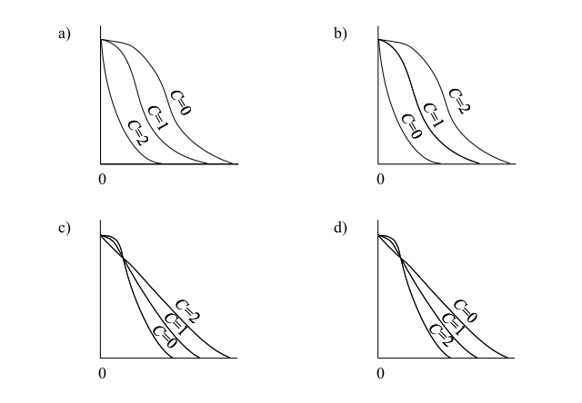

# 1 
Q1.In the single precision format of the “IEEE Standard for Binary Floating-Point Arithmetic”
(IEEE 754), a 32-bit floating point number is represented as below:
S: Sign (1 bit)
E: Exponent (8 bits)
F: Fraction (23 bits)
If 0 < E < 255, then the value of the number is (–1)S × 2 (E–127) × (1+F)
where F represents the fractional part of the number, stored as a 23-bit binary sequence. This
F is the sum of its weighted binary components: F=b1×2−1+b2×2−2+⋯+b23×2−23 , where b₁,
b₂, …, b₂₃ are the binary digits of F.
According to the IEEE-754 standard, which of the following is the decimal equivalent of the
32-bit floating point number given below?
01000001011000000000000000000000
a) 0.1875
b) 0.4375
c) 6.0
d) 14.0

#### 1. Split fields
- Sign (S) = `0` → positive  
- Exponent (E) = `10000010`  
- Fraction (F) = `11000000000000000000000`  

---

#### 2. Exponent calculation
Binary `10000010` = 130  

Exponent value:
E - 127 = 130 - 127 = 3  

---

#### 3. Fraction calculation
F = 1×2⁻¹ + 1×2⁻²  
  = 0.5 + 0.25  
  = 0.75  

So:
1 + F = 1.75  

---

#### 4. Final value
Value = (−1)ˢ × 2^(E−127) × (1 + F)  
      = (+1) × 2³ × 1.75  
      = 8 × 1.75  
      = 14.0  

---

### ✅ Answer:
**d) 14.0**

# 2
Q1.Let n be a binary integer represented in two’s complement. Which of the following is the
operation that results in the value 9 × n using only bit shifting and an addition or subtraction?
a) Shift n 2 bits to the left, then add n to the result.
b) Shift n 2 bits to the left, then subtract n from the result.
c) Shift n 3 bits to the left, then add n to the result.
d) Shift n 3 bits to the left, then subtract n from the result.

### explination
To compute \(9 \times n\) using bit shifts:

- Shifting left by 3 bits = \(n \times 2^3 = 8n\)

Now:
- \(8n + n = 9n\)

So the correct operation is:
**c) Shift n 3 bits to the left, then add n to the result.**

# 3
Q3.
Three friends and 4 other people are randomly seated in 7 seats arranged in a row. What is
the probability that the 3 friends sit next to one another?

)
1
168
b)
1
42
c)
1
35
d)
1
7

### Q3 Solution

Treat the 3 friends as a single block.

### Total arrangements:
7!  

### Favorable arrangements:
- Treat friends as one block → now we have 5 units (block + 4 others)
- Arrange these: 5! ways  
- Arrange friends within the block: 3! ways  

So:
Favorable = 5! × 3!

### Probability:
= (5! × 3!) / 7!  
= (120 × 6) / 5040  
= 720 / 5040  
= 1 / 7  

---

### ✅ Answer:
**d) 1/7**

# 4 Avrage Access Time CPU
Q9.When an HDD has the specifications shown in the table below, what is the average access
time for the HDD to transfer 16 kB of data in milliseconds (ms)? The average access time is
calculated as the sum of the average seek time, controller overhead, rotational latency, and
transfer time. Other overheads can be ignored. Here, 1 MB = 1,024 kB.

Average seek time5 ms
Rotation Speed6,000 RPM
Transfer rate1 MB/s
Controller overhead0.1 ms

a) 20.1
b) 25.725
c)30.725
d) 74.1

### Let’s compute it step by step (short and clear):

1. Given:

Seek time = 5 ms
Controller overhead = 0.1 ms
Rotation speed = 6000 RPM
Transfer rate = 1 MB/s
Data = 16 kB

2. Rotational latency

6000 RPM = 6000 / 60 = 100 rotations/sec
Time per rotation = 1 / 100 = 10 ms
Average latency = 10 / 2 = 5 ms

3. Transfer time

1 MB = 1024 kB
Time to transfer 16 kB = 16 / 1024 = 0.015625 s = 15.625 ms

4. Total access time
= Seek + Latency + Transfer + Overhead
= 5 + 5 + 15.625 + 0.1
= 25.725 ms

✅ Correct answer: b) 25.725 ms

# 5 3D printers
Q10.Which of the following is an appropriate description of a 3D printer’s function?
a) It detects the shape of three-dimensional objects and produces output of 3D data.
b) It functions by pushing the pins of a high-temperature printing head onto heat-sensitive
paper.
c) It makes three-dimensional objects using methods such as fused filament fabrication.
d) It projects computer graphics onto uneven three-dimensional objects such as buildings
and furniture.

### Explaination
a) Describes a 3D scanner, not a printer (it captures shapes, doesn’t create objects).
b) Describes a thermal printer, which uses heat on special paper.
c) ✅ Correct — A 3D printer creates physical 3D objects, commonly using methods like fused filament fabrication (FFF).
d) Describes projection mapping, not printing.

# 6 Logical Circuit!
Q16.Which of the following is equivalent to the logical circuit shown below?
[Q16 logical circuit ](quition16.png) 
a) A · B  
b) Ā · B  
c) A · B̄  
d) Ā · B̄
### Q16 Explanation

**Step 1: Top branch**
- A passes through NOT → Ā  
- Then AND with B → Ā · B  

**Step 2: Bottom branch**
- A and B go into NOR → (A + B)̄  

**Step 3: Final output**
Y = ((Ā · B) + (A + B)̄)̄  

**Step 4: Simplify**
(A + B)̄ = Ā · B̄  

Y = ((Ā · B) + (Ā · B̄))̄  
Y = (Ā (B + B̄))̄  
Y = (Ā · 1)̄  
Y = (Ā)̄ = A  

**Final Answer:**  
Y = A

# 7 prioritize traffic  
Q23. Which of the following is a mechanism used to prioritize traffic based on its importance
and minimize network latency for network applications?
a) AAA
b) PoE
c) QoS
d) RTP

### Q23 Answer

**Correct Option:** c) QoS

### Short Explanation

- **QoS (Quality of Service)** prioritizes important network traffic and reduces delay (latency), ensuring better performance for applications like video calls and gaming.

### Why others are incorrect

- **AAA** → Authentication, Authorization, Accounting (security-related)  
- **PoE** → Power over Ethernet (supplies power, not traffic control)  
- **RTP** → Real-time Transport Protocol (used for media streaming, not prioritization)

# 8  ARP behavior Broadcast
Q24. PC5 has been newly added to the network. It wants to send data to PC4 using SSH
protocol. It must resolve the MAC address of PC4 from its IP address before sending the data.
Which of the following is the destination MAC address that PC5 will use in ARP request?

a) 00:00:00:00:00:00
c) 78:E1:00:3C:A1:9F
b) 78:E1:00:3C:A1:8B
d) FF:FF:FF:FF:FF:FF

### Explanation (ARP behavior) 

When PC5 (192.168.1.11) wants to send data to PC4 (192.168.1.10), it must first find PC4’s MAC address using ARP.
Since PC5 does not yet know the MAC of PC4, it sends an ARP request to the local network using a broadcast MAC address so that all devices receive it.
ARP Request Destination MAC = Broadcast address

Broadcast MAC is:

FF:FF:FF:FF:FF:FF

Only PC4 will respond with its actual MAC address, while all other devices ignore the request.

Final Answer (copy-ready)
d) FF:FF:FF:FF:FF:FF

# 9 OSI Layer
Q25. Between LAN systems that are different from the transport layer upward in the OSI basic reference model, which of the following is a device that performs protocol conversion? 
a) Bridge b) Gateway c) Repeater d) Router

### Explanation
A gateway is the device that performs protocol conversion between different network systems, especially when the systems differ from the transport layer upward in the OSI model. It can translate between different communication protocols and architectures.
Quick comparison:
Repeater → Works at Physical layer (Layer 1), regenerates signals only
Bridge → Works at Data Link layer (Layer 2), connects LAN segments
Router → Works at Network layer (Layer 3), routes packets between networks
Gateway → Works across higher layers (Transport and above) and performs protocol conversion
So the best answer is Gateway.

# 10 
Q26. Which of the following is an Internet standard that extends the format of email header
fields to handle not only text messages but also audio and image files?
a) HTML
b) MHS
c) MIME
d) SMTP

MIME (Multipurpose Internet Mail Extensions) is the Internet standard that extends email format so it can carry not only plain text but also audio, images, video, and other file types. It works alongside email protocols like SMTP to allow attachments and rich content in emails.

Quick clarity on the options:

HTML → Markup language for web pages, not an email standard
MHS → Message Handling System (older X.400 email system)
MIME → ✅ Extends email to support multimedia content
SMTP → Simple Mail Transfer Protocol, used only for sending email, not handling attachments

So, the correct choice is MIME.

# 11 Critical Path
Q48 Eight (8) activities and milestones of a project are shown in the arrow diagram below.
Which of the following is the critical path of this project?

a) A, C, E, H
b) A, C, F, G
c) B, E, H
d) B, F, G

# 12 PERT ( Program Evaluation and Review Technique )
Q42. Based on the requirements gathered, the cost of a software project under normal
conditions is estimated at $70,000. In case of smooth project implementation, some activities
are not required and the estimated cost is reduced to $50,000; however, in the worst-case
scenario, additional tasks are required and the cost increases to $120,000. What is the
expected cost of the project (in dollars) that is calculated by using the three-point estimate in
the beta distribution, also known as PERT?
a) 70,000
b) 75,000
c) 80,000
d) 85,000
### PERT (Three-Point Estimate) Calculation

**Formula:**
Expected Cost = (O + 4M + P) / 6

Where:
- O (Optimistic) = 50,000  
- M (Most Likely) = 70,000  
- P (Pessimistic) = 120,000  

**Calculation:**
Expected Cost = (50,000 + 4 × 70,000 + 120,000) / 6  
Expected Cost = (50,000 + 280,000 + 120,000) / 6  
Expected Cost = 450,000 / 6  
Expected Cost = 75,000  

**Answer:** b) 75,000

# 13 SLA
Q43. IT services are provided under the conditions in the SLA shown below. What is the
maximum number of hours of downtime in a month that can satisfy the SLA?
[Conditions in the SLA]
‐Number of business days per month: 30
‐Service hours: 7 AM to 11 PM on business days
‐Agreed availability: 99% or more
‐Maintenance time can be ignored.
a) 1.2
b) 3.0
c) 4.8
d) 7.2

### First, calculate the total service hours per month:

Service hours per day = 7 AM to 11 PM = 16 hours
Number of days = 30
Total service time=30×16=480 hours
Apply SLA Availability (99%)

Allowed downtime = 1% of total time

Downtime=1%×480=0.01×480=4.8 hours
✅ Final Answer:

c) 4.8 hours

# 14 based on ITIL practices
Q44. Which of the following is an appropriate description of the relationship between a record
of an incident and a record of a problem in IT service management?
a) A cross-reference to the incident that triggered the problem is included in the record of
the problem.
b) If known errors have been identified at the time of ending the record of the problem, the
record of the incident that triggered the record of the problem is deleted.
c) One (1) problem record is always associated with one (1) incident record.
d) Problems are classified and recorded by a different criterion from the classification of
incidents.

### Relationship between a record
of an incident and a record of a problema) ✔️ Correct
A problem record includes a reference to the incident(s) that triggered its investigation.
b) ❌ Incorrect
Incident records are not deleted after problem analysis.
c) ❌ Incorrect
One problem can be linked to multiple incidents, not always one-to-one.
d) ❌ Misleading
While classification may differ, this does not describe their relationship.

# 15  
Q45. In the system design phase, when an audit is performed on the control to reduce the risk
of user requirements not being met, which of the following is a point to be checked?
a) Whether programming is performed in accordance with the specified conventions and
standards
b) Whether the program specifications are created on the basis of the system design
documents
c) Whether the test plan is created on the basis of the system test requirements, and the
manager’s approval of the system operations department is obtained
d) Whether the user department participates in the review of the system design documents

### Explaination
The question focuses on system design phase controls aimed at reducing the risk that user requirements are not met.

Key idea:

At the design stage, the most important control is ensuring that user requirements are correctly reflected in the design, which requires user involvement.

Evaluate options:
a) ❌ Programming standards → relates to development phase, not design
b) ❌ Program specs based on design → checks consistency, but doesn’t ensure user needs are met
c) ❌ Test planning → belongs to testing/operations phase
d) ✔️ Correct
Having the user department review system design documents ensures the design aligns with actual user requirements
✅ Final Answer:

d) Whether the user department participates in the review of the system design documents

# Green IT
Q56.
Which of the following is an example of Green IT?
a)Development of a powerful in-house data center
b)Development of efficient in-house software
c)Using a desktop PC instead of a thin client laptop
d)Using web conferencing instead of traveling to meetings

d) ✔️ Correct

# 16 CIO 
Q57.
Which of the following is a major role of a CIO?
a) The CIO creates a plan to optimize the effect of investment on information resources
across the company to support business strategy when a computerization strategy is
established.
b) The CIO gives advice to the information system department by auditing whether the
information system functions properly in corporate activities.
c) The CIO receives queries about the information system, reports on the problems, and
gives specific instructions to the department in charge to ensure optimal management of
the company-wide information system.
d) The CIO understands the status of information system development and operation and
provides specific instructions on improvements to ensure that the company-wide
information system functions optimally.

A CIO (Chief Information Officer) is responsible for aligning IT strategy with overall business strategy and ensuring investments in information systems deliver value.

Evaluate options:

a) ✔️ Correct
This describes the core CIO role: planning and optimizing IT investments to support business strategy.

b) ❌ This is more like an auditor’s role, not CIO

c) ❌ Describes operational support/helpdesk-type responsibilities

d) ❌ Focuses on operational management, closer to IT manager role

✅ Final Answer:
a) The CIO creates a plan to optimize the effect of investment on information resources across the company to support business strategy when a computerization strategy is established.

# 17 OC curve
Q58. The horizontal and vertical axes of an Operating Characteristic (OC) curve in quality
management generally represent the percent defective of a lot and the success rate of a lot,
respectively. Samples of size n are extracted from a lot of size N. When the number of
defective samples is less than or equal to the pass quantity C, the lot is considered to have
passed; otherwise, it is considered to have failed.
Which of the following is a diagram that shows the trend of change in the OC curve when
N and n are fixed and C takes the values 0, 1, and 2?

For an OC (Operating Characteristic) curve:

The x-axis = percent defective
The y-axis = probability of acceptance (success rate)
Key concept:

As the acceptance number C increases:

The inspection becomes less strict
More lots are accepted
The OC curve shifts upward (higher acceptance probability for the same defect rate)

So:

C = 0 → most strict → lowest curve
C = 1 → middle
C = 2 → least strict → highest curve
Correct diagram:

Look for the graph where curves are ordered:

C=0 (lowest),C=1 (middle),C=2 (highest)

# 18  Company Knowledge
Q59. Which of the following is a financial statement that represents the assets, liabilities, and
net assets of a company at a certain point in time and indicates the financial situation of the
company?
a) Balance sheet
c) Statement of Cash Flows
b) Income statement
d) Statement of Changes in Equity

### The question is asking:

👉 Which financial statement shows what a company owns and owes at a specific point in time?

Key meaning of the question:
Assets → what the company owns (cash, equipment, etc.)
Liabilities → what the company owes (loans, debts)
Net assets (equity) → the company’s value after debts

👉 And importantly: “at a certain point in time” (like a snapshot)

Evaluate options:
a) Balance sheet ✔️
Shows assets, liabilities, and equity at a specific date (snapshot of financial position)
b) Income statement ❌
Shows profit/loss over a period of time
c) Statement of Cash Flows ❌
Shows cash movement over time
d) Statement of Changes in Equity ❌
Shows how equity changes over time
Simple analogy:
Balance Sheet = Photo 📸 (at one moment)
Others = Video 🎥 (over a period)
✅ Final Answer:

# Agreement of sofs Lincesen of sharp-wrap

Q60. For a shrink-wrap license, which of the following is the point in time when a software
license agreement is concluded?
a) At the time the purchased software is paid for
b) At the time the CD-ROM containing the software is received
c) At the time the DVD-ROM package containing the software is opened
d) At the time the software is installed on a PC

### This question is about when a shrink-wrap license becomes legally valid.

Key idea:

A shrink-wrap license means:
👉 You agree to the license when you open the package (breaking the seal)

Evaluate options:
a) ❌ Paying doesn’t mean you agreed to the license yet
b) ❌ Receiving the product ≠ agreement
c) ✔️ Correct
Opening the package = you accept the license terms inside
d) ❌ Installation is too late (agreement already happened earlier)
Simple explanation:
Box is sealed → you haven’t agreed yet
You open it → you accept the terms

